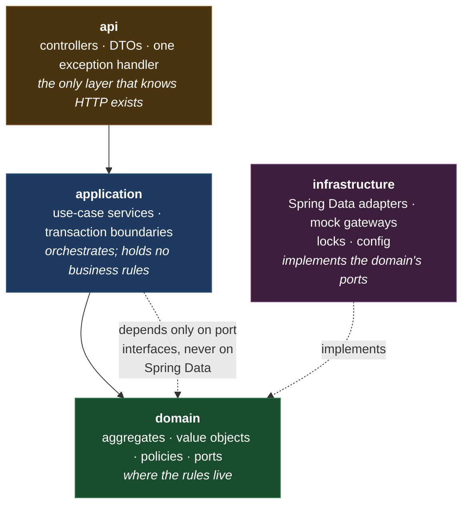
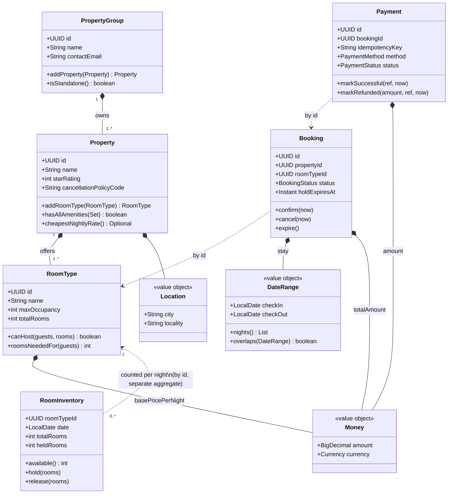
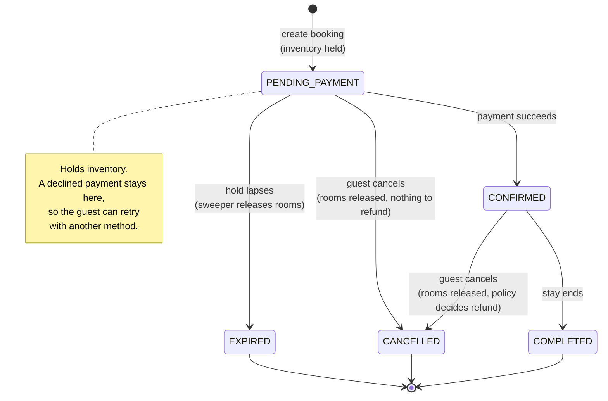
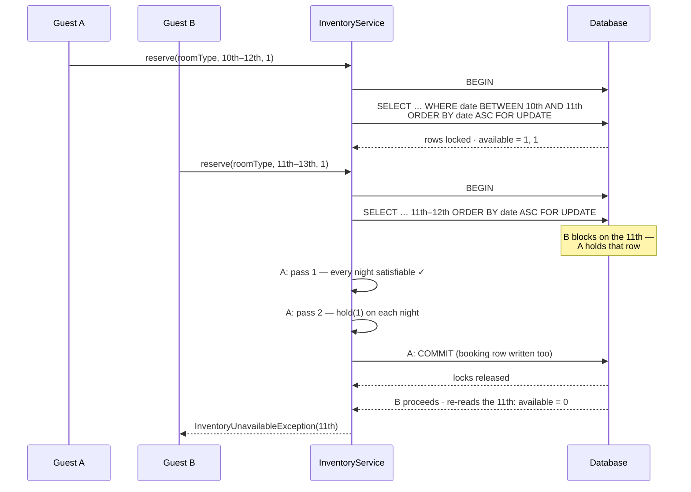

# Design

Why this service is shaped the way it is. Every section names the alternative that was rejected and
what it would have cost, because a decision without a discarded option is not really a decision.

- [Layering](#layering)
- [Domain model](#domain-model)
- [Booking lifecycle](#booking-lifecycle)
- [The eight decisions](#the-eight-decisions)
- [Preventing double-booking](#preventing-double-booking)
- [Payment idempotency](#payment-idempotency)
- [Extending the system](#extending-the-system)
- [Trade-offs taken knowingly](#trade-offs-taken-knowingly)
- [Considered and rejected](#considered-and-rejected)

---

## Layering



The arrow that matters is the dotted one pointing *up* from `infrastructure`. Repository interfaces
are declared in `domain/port` and implemented in `infrastructure/persistence`, so the dependency runs
opposite to the call direction. That is what makes swapping H2 for Postgres — or for an in-memory map
in a unit test — a change confined to one package.

Two invariants I held to, both checkable by grep:

- No class in `domain` or `application` imports `org.springframework.http` or
  `org.springframework.data`.
- No class in `domain` imports anything from `application`, `infrastructure` or `api`.

---

## Domain model



**Four aggregates, not one graph.** `PropertyGroup` (with its properties and room types),
`RoomInventory`, `Booking` and `Payment` are separate aggregates that reference each other by **id**
rather than by object reference. Two reasons:

- A booking should not be able to reach through and mutate the hotel's configuration. Referencing by
  id makes that structurally impossible rather than merely discouraged.
- Inventory is hundreds of rows per room type and is the only contended data in the system. Keeping
  it out of the property graph means locking one night's inventory does not drag an entire chain's
  object graph into the persistence session.

**The value objects are not decoration.** `Money` refuses to add INR to USD and normalises scale so
`INR 100` equals `INR 100.00`. `DateRange` rejects a check-out that is not after check-in, at
construction. `Location` lower-cases on the way in so search never has to think about casing. Each is
a class of bug that becomes unrepresentable rather than merely untested.

---

## Booking lifecycle



The table lives in `BookingStatus`, and `Booking.transitionTo` is the only way through it. There is
**no setter for status**, so a service, a controller, or a future contributor cannot put a booking
into a state the lifecycle forbids. Cancelling twice, paying for an expired booking and reviving a
cancelled one all fail identically, in the same place, with the same exception.

`BookingStatus.holdsInventory()` is the second reason the enum earns its keep: cancellation and the
expiry sweeper both need to know whether a booking still occupies rooms, and asking the status beats
each of them re-deriving it from a list of state names.

---

## The eight decisions

### 1. A single property is a group of one

The brief asks for a standalone property to be a natural special case of the multi-property structure
rather than a separate hard-coded path. The way to get that is to **refuse to model "single" and
"chain" as two things**.

There is exactly one ownership shape: a `PropertyGroup` holding one or more properties. A standalone
hotel is a group whose list has one element. `isStandalone()` is a *derived question*
(`properties.size() == 1`), never stored state — so no code can branch on a flag that has drifted out
of sync with reality, and there is no "convert standalone to chain" operation because there is nothing
to convert.

The test that proves it is `standaloneOwnerGrowsIntoAChain`: onboard an owner with one hotel, add a
second through the ordinary endpoint, and it is a chain. No migration step exists because none is
needed.

**Rejected:** an `ownerType: SINGLE | CHAIN` discriminator, or separate `Hotel` and `HotelChain`
types. Both create a second source of truth that can contradict the first, and both make the fiftieth
property a different code path from the first.

### 2. Inventory is a count per (room type, night)

The single most consequential modelling decision. Availability is tracked as
`(roomTypeId, date) → {totalRooms, heldRooms}`, not as an assignment of named rooms to guests.

Guests do not care which of eight identical deluxe rooms they get, and hotels reassign rooms at the
front desk anyway. The payoff is that availability becomes **integer arithmetic over a date range**
instead of a matching problem over individual rooms — which is what makes the concurrency-critical
section small enough to reason about and small enough to prove.

The cost is real: "give me room 402" cannot be expressed, and neither can per-room attributes
(a specific balcony, an accessible bathroom in one particular room). The honest fix is a second
concept — room-level assignment at check-in, layered on top of type-level availability at booking —
which is roughly how the industry does it.

### 3. Half-open date ranges

A stay is `[checkIn, checkOut)`. The nights it occupies are exactly `checkIn … checkOut-1`, so two
stays collide **if and only if** their night sets intersect.

This is a small decision with a large blast radius. A guest checking out on the 5th and another
checking in on the 5th are not in conflict — and that falls out of the model for free rather than
needing an off-by-one special case at every call site. `DateRangeTest` pins it down explicitly,
because if check-out day ever started counting as a night, every property in the system would appear
one night more booked than it is.

### 4. Hold inventory before charging

`BookingService.create` takes the rooms first; the booking begins life in `PENDING_PAYMENT`.

The alternative — charge first, then try to grab a room — fails badly in exactly the case that
matters. If the rooms are gone you have taken money for a stay that cannot happen and now owe a
refund, which means the unhappy path involves moving money backwards. Holding first means the failure
lands where it is cheap: on a guest who has not been charged.

The cost is that an abandoned checkout would sterilise saleable rooms indefinitely. So every hold
carries an expiry and `HoldExpirySweeper` returns the rooms to sale. **That is the trade:** a small,
bounded window in which rooms are held for someone who may never pay, in exchange for never charging
for a room we cannot deliver.

`PaymentService` also expires a lapsed hold on the spot rather than waiting for the sweep, because the
sweeper runs on a schedule and a payment can legitimately arrive in between.

### 5. The payment outcome owns the booking state

`PaymentService` is the **only caller of `Booking.confirm()` in the codebase**. A successful charge
confirms; a declined one leaves the booking in `PENDING_PAYMENT` so the guest can try another method
while the hold lasts.

The brief asks for the payment outcome to drive the booking state. The way to *guarantee* that,
rather than merely arrange it, is to leave exactly one caller of `confirm()` — which is checkable in
one grep and stays true as the codebase grows.

### 6. Releasing rooms and refunding money are separate concerns

A non-refundable booking still gives its rooms back.

Tying the two together would mean a non-refundable cancellation left rooms locked up for a stay
nobody was going to turn up for — punishing the hotel for the guest's cheap rate. So the inventory
release is unconditional and the refund is a policy decision, and the two never consult each other.
`nonRefundableStillReleasesInventory` is the test.

Order of operations inside `CancellationService`: **state change → inventory → money.** The booking
transitions first because `Booking.cancel()` is what rejects a double cancellation, so a second
request cannot get as far as releasing the same rooms twice or issuing a second refund. The gateway
call comes last, so an illegal-state or inventory failure aborts before any money moves.

### 7. Time is injected

Every class that needs "now" takes a `java.time.Clock` in its constructor. No business code calls
`Instant.now()`.

This is what makes `CancellationPolicyTest` able to assert on the 24-hour boundary *exactly* —
24 hours precisely earns a full refund, one minute inside earns nothing — and what lets
`expiredHoldReleasesInventory` walk past a 15-minute hold without sleeping. Time-dependent behaviour
that reads the system clock is either untestable or flaky; there is no third option.

### 8. A distributed lock is not a domain concept

Running two instances means two copies of the hold-expiry sweeper, each on its own timer. That was
always *survivable* — `Booking.expire()` rejects a second expiry, so the state stays correct — but it
meant N instances doing N times the work and contending on the same inventory rows to discover there
was nothing to do.

The fix is a lock, and the interesting question is where the interface belongs. It is **not** in
`domain/port`, alongside `BookingRepository` and `PaymentGateway`. Those are contracts the *domain*
needs the outside world to satisfy: the business genuinely needs somewhere to put a booking and
someone to move money. No hotelier has an opinion about mutual exclusion. The lock exists only because
we chose to run more than one copy of the process, which makes it a deployment detail — so
`SweepLock` lives in `infrastructure/lock` next to the other deployment details.

Two implementations, and the sweeper contains no `if`:

- `InProcessSweepLock` — the default, declared `@ConditionalOnMissingBean`, so it steps aside
  automatically the moment anything else provides a `SweepLock`. No profile check, no knowledge that
  Redis exists.
- `RedisSweepLock` — `@Profile("redis")`. A single `SET key token NX PX ttl`: `NX` gives the mutual
  exclusion, `PX` is the safety valve so a crashed holder cannot wedge the sweeper forever. Release
  deletes the key only if the token still matches, so a holder whose lease already expired cannot
  delete a lock a different instance now legitimately owns.

**What it is not:** this is not Redlock, and a lease that expires mid-sweep means two instances sweep
at once. That is acceptable *because the sweeper is idempotent* — the worst case is wasted work, not
wrong state. Being precise about that boundary is better than implying thirty lines of Redis calls
are bulletproof; anything stronger belongs to ShedLock or Redisson, not to this file.

---

## Preventing double-booking

### The problem

Two guests ask for the last room on the same night at the same instant. Both read "1 available", both
decide yes, both write "held = 1", and the hotel has sold one room twice.

The read and the write must be one indivisible step. No amount of care in application code achieves
that on its own — the database has to serialise it.

### The mechanism



Three details make this correct rather than merely plausible:

**1. Locks are acquired in ascending date order.** Enforced by `ORDER BY i.date ASC` in the locking
query. Overlapping stays therefore contend on their shared nights in the same sequence, so no two
transactions can each hold a row the other is waiting for. Without a consistent order, a 3rd–5th
booking racing a 4th–6th booking can deadlock: one grabs the 4th and wants the 3rd, the other grabs
the 3rd and wants the 4th. A global lock order is the textbook cure for deadlock, and here the date
*is* the natural global order.

`overlappingStaysNeverOversellAndNeverDeadlock` runs exactly that arrangement across 20 threads with
staggered overlaps. That the test terminates at all is the evidence.

**2. Check every night, then mutate every night.** Two passes, not one. A single fused loop would
leave half the stay held when the fifth night turns out to be full, and correctness would then depend
on the rollback actually happening. Two passes mean the in-memory state is never inconsistent in the
first place — and the error can name the exact night that failed, which is what a caller needs to
suggest alternatives. `partialAvailabilityIsRefusedAtomically` asserts the nights either side are
untouched.

**3. `Propagation.MANDATORY`.** A lock is only worth anything until its transaction commits. If
`reserve` were ever called outside a transaction — or opened its own — the lock would be released the
moment it returned, leaving a window before the booking was persisted in which another request could
take the same room. Declaring `MANDATORY` turns that subtle race into a loud wiring error.

`release` takes the same locks in the same order, because releasing is every bit as much a
read-modify-write as reserving; a lock-free release could interleave with a concurrent reservation and
lose one of the two updates.

**Belt and braces:** `RoomInventory.hold()` refuses to exceed `totalRooms` regardless. Even with a bug
in the locking layer, the entity cannot be made to oversell. `RoomInventoryTest` asserts that
directly, with no database involved.

### Search does not take locks

`lowestAvailabilityPerRoomType` is a deliberately lock-free read. A room shown as available may be
gone by the time the guest clicks book, and that is fine — the answer is advisory and `reserve`
re-checks under a lock. Taking write locks during search would mean a browsing user blocks a paying
one.

It aggregates the **minimum** across the stay, because a stay needs the room on *every* night. An
average or a first-night check would advertise stays that cannot actually be completed.

---

## Payment idempotency

Payment is the one operation where a retry costs the customer real money, and it is also the operation
most likely to be retried — a client that times out mid-charge genuinely does not know whether the
money moved.

Two shapes of duplicate, stopped by two different mechanisms:

| Shape | What stops it |
|---|---|
| **Sequential retry** — client times out, retries with the same key | The idempotency lookup finds the stored payment and returns its outcome. The gateway is never called again. Response is `200` with `idempotentReplay: true`. |
| **Concurrent duplicate** — double-click, parallel retry | The unique constraint on `idempotency_key`. Both requests pass the lookup, both attempt the insert, the database lets exactly one through. The loser gets `409 DUPLICATE_REQUEST` and its retry then takes the replay path. |

### The ordering bug this design had, and the fix

The first version of `PaymentService` did `save()` → call gateway → `save()`, with a comment claiming
"insert first, charge second, so the constraint rejects the loser before any money moves."

**That comment was wrong.** Spring Data's `save()` does not flush — the INSERT is deferred to commit,
which is *after* the gateway call. So two concurrent requests with one key would both pass the lookup,
both charge the card, and only one would survive to record it. Money moved twice, recorded once: the
worst possible failure mode for this operation.

The fix is the port method `PaymentRepository.saveAndClaimIdempotencyKey` (`saveAndFlush` in the
adapter), which forces the INSERT to reach the database *before* the gateway is called. The loser of
the race now fails at that line, with no external side effect.

The bug was caught by `concurrentDuplicatesChargeOnce`, which asserts on the **wallet gateway's
balance** rather than on our own payment records. That is the reason the assertion is written that
way: "did the money move twice?" is a question that must be answered by looking at the money, because
the buggy version's own records looked perfectly correct.

### One consequence worth stating

A **declined** charge also consumes its key. Retrying with the same key replays the decline rather
than attempting a fresh charge — which is the correct reading of idempotency: the same request yields
the same outcome. A guest genuinely trying again gets a new key, which is what clients do per checkout
attempt anyway.

The key is also passed onward to the gateway, so even a duplicate that somehow reached the provider
twice would be collapsed at their end. Defence in depth, since the money is real.

---

## Extending the system

The brief asks that new types be addable with minimal, localised change. Here is the actual cost of
each, measured in files touched.

### A new payment method — 1 new file, 1 line

```java
@Component
public class MockNetBankingGateway implements PaymentGateway {
    @Override public PaymentMethod supports() { return PaymentMethod.NET_BANKING; }
    @Override public ChargeResult charge(ChargeCommand c) { /* … */ }
    @Override public RefundResult refund(RefundCommand c) { /* … */ }
}
```

Plus `NET_BANKING` in the `PaymentMethod` enum. `PaymentGatewayRegistry` builds its map from whatever
`PaymentGateway` beans exist, so nothing else changes — and there is no `switch (method)` anywhere to
grow a case. `MockUpiGateway` is the existing evidence: supporting UPI required adding that one file.

The registry also fails at **startup** if two gateways claim the same method, rather than silently
using whichever Spring injected last.

### A new search filter — 1 new file, 1 line

```java
public class EvChargingFilter implements PropertyFilter {
    @Override public boolean isApplicable(PropertySearchCriteria c) {
        return c.requiredAmenities().contains(Amenity.EV_CHARGING);
    }
    @Override public boolean matches(Property p, PropertySearchCriteria c) {
        return p.amenities().contains(Amenity.EV_CHARGING);
    }
}
```

Plus one `@Bean` line in `DomainConfiguration`. `PropertySearchService` holds a
`List<PropertyFilter>` and never names a filter, so it does not change. Deleting a filter cannot break
another, because none of them can see each other.

The two-method split matters: `isApplicable` answers "did the guest ask about this at all?" and
`matches` answers "does this property satisfy it?". Folding them into one method that returns `true`
when the criterion is absent works, but it loses the distinction between *passed* and *not asked* —
which is exactly what you want to report when explaining why a search returned nothing.

### A new cancellation policy — 1 new file, 1 line

```java
public class FreeUntilCheckInPolicy implements CancellationPolicy {
    public static final String CODE = "FREE_UNTIL_CHECK_IN";
    @Override public String code() { return CODE; }
    @Override public String description() { return "Free cancellation until check-in"; }
    @Override public RefundDecision evaluate(Booking b, Instant now) { /* … */ }
}
```

A property stores only the policy **code**, so the property row has no dependency on the class that
implements the rule. `CancellationService` does not know how many policies exist. And because the
choice is data on the property rather than a global setting, different properties in one chain can run
different policies — `policiesArePerPropertyNotPerOwner` asserts that.

An unknown code is rejected at **onboarding**, with the list of codes that do exist. Accepting it there
would defer the failure to the guest's cancellation attempt, which is the worst possible moment.

### Dynamic pricing — new implementations only

`PricingStrategy` takes a `PricingRequest` parameter object rather than a long argument list,
specifically so that adding an input (current occupancy, for yield pricing) does not break every
implementation's signature. Weekend surge, length-of-stay discount and occupancy-based yield are each
a decorator wrapping `StandardPricingStrategy`. `BookingService` asks for a quote and is told a
number; it does not change.

---

## Trade-offs taken knowingly

| # | Decision | Bought | Cost | Where the line would move |
|---|---|---|---|---|
| 1 | **Entities carry JPA annotations** rather than mapping to separate persistence types | Roughly half the classes; no mapper layer | `domain` needs `jakarta.persistence` to compile | If the domain outlived this schema, or a second persistence mechanism appeared. The *ports* are already pure, so the expensive half is done. |
| 2 | **Pessimistic row locks** over optimistic `@Version` | Simple to reason about; deadlock-free by construction; no retry logic | Serialises access to a room type's nights; a lock wait is a held connection | Under low contention, optimistic + bounded retry wins. Worth having both behind `InventoryService`. |
| 3 | **Count-based inventory**, not named rooms | Availability is integer arithmetic; tiny critical section | Cannot express "room 402" or per-room attributes | Add room-level assignment at check-in *on top of* type-level availability at booking. |
| 4 | **Inventory materialised 365 days ahead** at onboarding | Removes a second race (concurrent lazy row creation); booking path has one concurrency concern | 365 rows per room type up front | A rolling-window job plus `INSERT … ON CONFLICT DO NOTHING`. |
| 5 | **Eager collections** on the property graph | Entities can be mapped to DTOs after the transaction closes, with `open-in-view` off | A wide join; unsuitable for thousand-property chains | Paginate, and use projections for the read paths. |
| 6 | **`Amenity` as an enum** | Type-safe, typo-free filtering | Adding "EV charging" costs a deploy | Reference table with a cached lookup, validated at the API boundary. |
| 7 | **Search as `POST`** | Open-ended structured criteria; no URL length limit | Not URL-cacheable | Moot — results depend on live inventory. |
| 8 | **Refund inside the DB transaction** | Simple; no extra machinery | Gateway succeeds + commit fails ⇒ records disagree with the provider | An outbox. This is the one real correctness gap and it is [item 1 in the README's next steps](README.md#what-i-would-do-with-more-time). |
| 9 | **`Set` + `@OrderBy`** for entity collections | Avoids `MultipleBagFetchException` with nested eager collections | Slightly unusual-looking mapping | Nothing; this is just the correct JPA answer. Accessors still return `List` so no call site cares. |
| 10 | **H2 by default, Postgres behind a profile** | The service runs with zero infrastructure, and the persistence swap is still demonstrable | Two drivers on the classpath; the default path is not the deployed one | CI should run the suite under both. The compose file exists; Testcontainers would automate it. |
| 11 | **`ddl-auto: update` on Postgres** | No migration tooling to set up for a prototype | Unmanaged schema drift; fine once, wrong twice | Flyway, as soon as anything has to be migrated rather than recreated. |

---

## Considered and rejected

### Optimistic locking (`@Version` + retry)

Each inventory row carries a version; a concurrent update throws and a retry wrapper re-runs the
reservation.

**Better** under low contention — no locks held, no connection parked waiting. **Rejected** because
the failure semantics get more involved (how many retries? with what backoff? is a retry storm on the
last room worse than a queue?), and because a multi-night stay means N rows can each independently
lose, so a single conflict re-runs the whole check. Pessimistic locking makes the contended case
*boring*, which is what I want in the code path that must not be wrong.

**Rejected for inventory, used for `Booking`.** The two have different shapes and get different
answers. Inventory contention is expected, concentrated on known rows, and spans N nights at once —
exactly where pessimistic locking pays. A booking is contended only by accident: a guest paying while
support cancels, say. Nothing serialised *that*, because paying and cancelling touch no common
inventory row, and the dangerous interleaving is silent — a cancellation can evaluate the refund,
correctly find no payment settled yet, and record "nothing to refund" just before the payment
commits, leaving the guest charged, cancelled and never refunded. `@Version` on `Booking` makes the
second writer fail loudly instead. One row, no retry loop, no storm — none of the objections above
apply. `ConcurrentBookingIntegrationTest` pins it.

### Atomic conditional UPDATE

```sql
UPDATE room_inventory SET held_rooms = held_rooms + :n
 WHERE room_type_id = :rt AND stay_date BETWEEN :from AND :to
   AND total_rooms - held_rooms >= :n
```
…then assert the affected-row count equals the number of nights, and roll back otherwise.

**Elegant and lock-free**, and genuinely the fastest of the three. **Rejected** for a code-review
exercise because it pushes the core invariant into a SQL string where it is least visible to a
reviewer, and because the "did I update every night?" check is an easy thing to get wrong quietly. It
also cannot report *which* night failed without a second query, and that detail is what makes the
error message useful.

### Application-level lock striping (`ReentrantLock` per room type)

Cheap, no database involvement, and works fine on one instance.

**Rejected** because it is wrong the moment there are two instances, and it is wrong in a way that
does not show up in testing. A design whose correctness depends on never scaling out is a design with
a trap in it.

### `SERIALIZABLE` isolation

Correct by fiat. **Rejected** as far too blunt: it serialises transactions that share no rows at all,
so one hotel's bookings would contend with another's.

### Ports extending `JpaRepository` directly

Would delete a dozen small adapter classes, and is a defensible choice for a prototype.

**Rejected** because it inverts the dependency the wrong way. `domain` would need Spring Data on the
classpath to compile, and the port interfaces would silently acquire forty methods
(`deleteAllInBatch`, `findAll(Pageable)`) that the domain never wants and that callers would
eventually start using. The adapters are ten lines each and buy a boundary that stays where it was
put.

### A `Room` entity with per-room assignment

The "correct" model in a textbook sense. **Rejected** for this exercise: it turns availability from
arithmetic into a matching problem, and the resulting critical section is much harder to prove correct
under concurrency. Since concurrency on shared inventory is explicitly what the brief wants to see,
choosing the model that makes that provable was the better trade. The upgrade path is additive, not a
rewrite.

### Caching search results in Redis

Redis is already there under the `redis` profile, and search is the hottest read path — so caching
availability looks like the obvious win.

**Rejected**, and not on effort grounds. Inventory changes on *every* booking, so a cached
availability answer is a wrong availability answer within milliseconds. Correct invalidation means
evicting every cache entry whose date range overlaps the booked stay, for every filter combination
that could have produced it — which is a harder problem than the query being replaced, and it fails in
the worst possible direction: showing a guest a room that is gone. The lock-free availability read is
already cheap, and booking re-checks under a row lock regardless. If search ever became the
bottleneck, the answer is a read replica or a denormalised availability projection, not a TTL cache
over live inventory.

### Storing `isStandalone` on `PropertyGroup`

Would save a `size()` call. **Rejected** because it creates a second source of truth that can
disagree with the first, and the bug it produces — a flag saying "standalone" on a group with three
properties — is the kind that survives for years.
